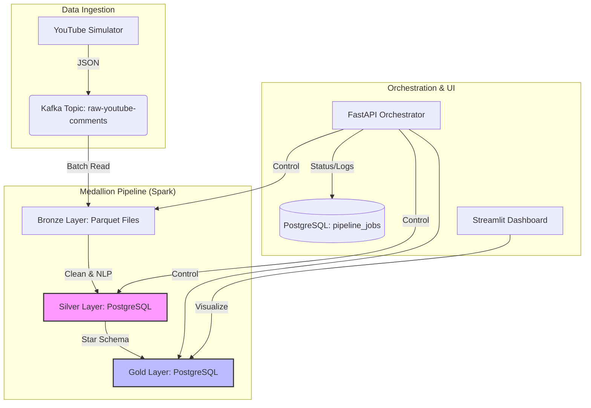

# YouTube Sentiment Pipeline

A modular, API-driven ETL pipeline for analyzing YouTube comment sentiment and emotions using Kafka, Spark, and PostgreSQL.

## Project Structure

```text
youtube-sentiment-pipeline/
├── config/                  # Configuration templates and .env
├── data/                    # Local storage for Bronze (Parquet)
├── pentaho/                 # Optional PDI jobs and aggregation scripts
├── postman/                 # API Collection and Environment
├── src/
│   ├── api/                 # FastAPI orchestration layer
│   ├── dashboard/           # Streamlit visualization app
│   ├── nlp/                 # Emotion and sentiment model logic
│   ├── producer/            # YouTube simulator and Kafka producers
│   ├── spark/               # Medallion layer transformations (Bronze/Silver/Gold)
│   └── utils/               # Database, Spark, and Orchestrator utilities
├── docker-compose.yml       # Infrastructure orchestration
├── run_pipeline.py          # Robust CLI wrapper for the orchestrator
├── setup_database.py        # Database schema initialization
└── requirements.txt         # Python dependencies
```

## Architecture & Workflow



## Getting Started

### 1. Infrastructure Setup
Ensure Docker Desktop is running, then start the core services:
```bash
docker-compose up -d
```
This starts Kafka, Zookeeper, PostgreSQL, pgAdmin, and the Spark Cluster.

### 2. Initialize Database (Skip if using via API `/jobs`)
Create the necessary tables and job tracking schema:
```bash
uv run python setup_database.py
```

### 3. Start the Orchestration API
The pipeline is managed through a FastAPI backend. Start it with:
```bash
uv run uvicorn src.api.main:app --reload
```
The API will be available at `http://localhost:8000`. You can explore the interactive docs at `http://localhost:8000/docs`.

### 4. Run the Dashboard
Visualize the results in real-time:
```bash
uv run streamlit run src/dashboard/app.py
```

---

## Orchestration via API

Instead of running long scripts manually, you can trigger pipeline steps via the API or the provided Postman collection.

### Trigger a Job
**Endpoint:** `POST /jobs`
**Body:**
```json
{
    "steps": ["Database Setup", "Producer Simulator", "Bronze", "Silver", "Gold (Emotion)"]
}
```
*Leave `steps` as `null` to run the full pipeline.*

### Check Job Status & Logs
**Endpoint:** `GET /jobs/{job_id}`
Returns the current status (`running`, `completed`, `failed`) and the full execution logs.

---

## Architecture (Medallion)

- **Bronze:** Raw Kafka messages saved as Parquet.
- **Silver:** Cleaned data with **NLP Augmentation**. Sentiment and Emotion analysis are performed here to ensure they are only calculated once.
- **Gold:** Star Schema (Fact & Dimensions) and aggregations for reporting.
